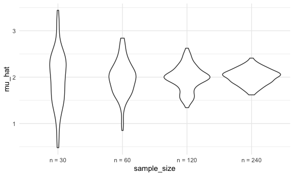

Simulation
================
Yuqi Wang

``` r
library(tidyverse)
```

    ## ── Attaching packages ─────────────────────────────────────── tidyverse 1.3.0 ──

    ## ✓ ggplot2 3.3.2     ✓ purrr   0.3.4
    ## ✓ tibble  3.0.3     ✓ dplyr   1.0.2
    ## ✓ tidyr   1.1.2     ✓ stringr 1.4.0
    ## ✓ readr   1.3.1     ✓ forcats 0.5.0

    ## ── Conflicts ────────────────────────────────────────── tidyverse_conflicts() ──
    ## x dplyr::filter() masks stats::filter()
    ## x dplyr::lag()    masks stats::lag()

``` r
library(rvest)
```

    ## Loading required package: xml2

    ## 
    ## Attaching package: 'rvest'

    ## The following object is masked from 'package:purrr':
    ## 
    ##     pluck

    ## The following object is masked from 'package:readr':
    ## 
    ##     guess_encoding

``` r
knitr::opts_chunk$set(
  fig.width = 6,
  fig.asp = .6,
  out.width = "90%"
)

theme_set(theme_minimal() + theme(legend.position = "bottom"))

options(
  ggplot2.continuous.colour = "viridis",
  ggplot2.continuous.fill = "viridis"
)

scale_colour_discrete = scale_colour_viridis_d
scale_fill_discrete = scale_fill_viridis_d

set.seed(1)
```

## Let’s simulate something

I have the function

``` r
sim_mean_sd = function(n, mu = 2, sigma = 3) {
  
  sim_data = tibble(
    x = rnorm(n, mean = mu, sd = sigma),
  )
  
  sim_data %>% 
    summarize(
      mu_hat = mean(x),
      sigma_hat = sd(x)
    )
}
```

I can simulate by running this line

``` r
sim_mean_sd(30)
```

    ## # A tibble: 1 x 2
    ##   mu_hat sigma_hat
    ##    <dbl>     <dbl>
    ## 1   2.25      2.77

## Let’s simulate a lot

Let’s start with a for loop

``` r
output = vector("list", length = 100)

for (i in 1:100) {
  output[[i]] = sim_mean_sd(30)
}

bind_rows(output)
```

    ## # A tibble: 100 x 2
    ##    mu_hat sigma_hat
    ##     <dbl>     <dbl>
    ##  1   2.40      2.39
    ##  2   2.33      2.88
    ##  3   2.34      2.65
    ##  4   1.01      2.77
    ##  5   2.71      3.17
    ##  6   2.20      3.25
    ##  7   1.29      3.04
    ##  8   2.07      2.79
    ##  9   2.41      3.09
    ## 10   2.65      2.84
    ## # … with 90 more rows

Let’s use a loop function:

``` r
sim_result = rerun(100, sim_mean_sd(30)) %>% 
  bind_rows()
```

Let’s look at results:

``` r
sim_result %>% 
  ggplot(aes(x = mu_hat)) + geom_density()
```


``` r
sim_result %>% summarize(
  avg_samp_mean = mean(mu_hat),
  sd_samp_mean = sd(mu_hat)
)
```

    ## # A tibble: 1 x 2
    ##   avg_samp_mean sd_samp_mean
    ##           <dbl>        <dbl>
    ## 1          1.99        0.567

``` r
sim_result %>% 
  ggplot(aes(x = sigma_hat)) + geom_density()
```


## let’s try other sample sizes

``` r
n_list = 
  list(
    "n_30"  = 30, 
    "n_60"  = 60, 
    "n_120" = 120, 
    "n_240" = 240)

output = vector("list", length = 4)

for (i in 1:4) {
  output[[i]] = rerun(100, sim_mean_sd(n_list[[i]])) %>% 
  bind_rows()
}
```

``` r
#'cache ='  means run the code for one time and use the saved result everytime you knit. But very easy to break.
sim_result = tibble(
  sample_size = c(30, 60, 120, 240),
  ) %>% 
  mutate(
    output_lists = map(.x = sample_size, ~rerun(100, sim_mean_sd(.x))),
    estimate_df = map(output_lists, bind_rows)
  ) %>% 
  select(-output_lists) %>% 
  unnest(estimate_df)
```

Do some data frame things

``` r
sim_result %>% 
  mutate(
    sample_size = str_c("n = ", sample_size),
    sample_size = fct_inorder(sample_size)
  ) %>% 
  ggplot(aes(x = sample_size, y = mu_hat)) +
  geom_violin()
```



``` r
sim_result %>% 
  group_by(sample_size) %>% 
  summarize(
    avg_samp_mean = mean(mu_hat),
    sd_samp_mean = sd(mu_hat)
  )
```

    ## `summarise()` ungrouping output (override with `.groups` argument)

    ## # A tibble: 4 x 3
    ##   sample_size avg_samp_mean sd_samp_mean
    ##         <dbl>         <dbl>        <dbl>
    ## 1          30          1.97        0.595
    ## 2          60          1.98        0.379
    ## 3         120          1.98        0.266
    ## 4         240          2.01        0.165
