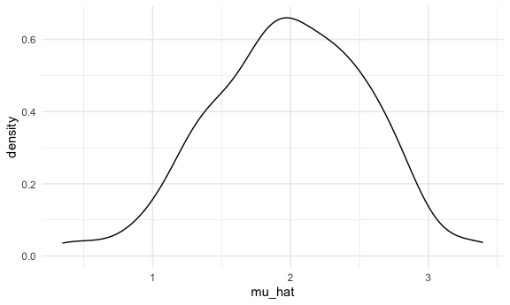
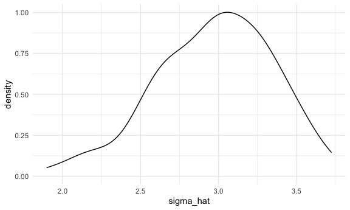

Simulation
================
Yuqi Wang

``` r
library(tidyverse)
```

    ## ── Attaching packages ─────────────────────────────────────── tidyverse 1.3.0 ──

    ## ✓ ggplot2 3.3.2     ✓ purrr   0.3.4
    ## ✓ tibble  3.0.3     ✓ dplyr   1.0.2
    ## ✓ tidyr   1.1.2     ✓ stringr 1.4.0
    ## ✓ readr   1.3.1     ✓ forcats 0.5.0

    ## ── Conflicts ────────────────────────────────────────── tidyverse_conflicts() ──
    ## x dplyr::filter() masks stats::filter()
    ## x dplyr::lag()    masks stats::lag()

``` r
library(rvest)
```

    ## Loading required package: xml2

    ## 
    ## Attaching package: 'rvest'

    ## The following object is masked from 'package:purrr':
    ## 
    ##     pluck

    ## The following object is masked from 'package:readr':
    ## 
    ##     guess_encoding

``` r
knitr::opts_chunk$set(
  fig.width = 6,
  fig.asp = .6,
  out.width = "90%"
)

theme_set(theme_minimal() + theme(legend.position = "bottom"))

options(
  ggplot2.continuous.colour = "viridis",
  ggplot2.continuous.fill = "viridis"
)

scale_colour_discrete = scale_colour_viridis_d
scale_fill_discrete = scale_fill_viridis_d
```

## Let’s simulate something

I have the function

``` r
sim_mean_sd = function(n, mu = 2, sigma = 3) {
  
  sim_data = tibble(
    x = rnorm(n, mean = mu, sd = sigma),
  )
  
  sim_data %>% 
    summarize(
      mu_hat = mean(x),
      sigma_hat = sd(x)
    )
}
```

I can simulate by running this line

``` r
sim_mean_sd(30)
```

    ## # A tibble: 1 x 2
    ##   mu_hat sigma_hat
    ##    <dbl>     <dbl>
    ## 1   1.80      2.35

## Let’s simulate a lot

Let’s start with a for loop

``` r
output = vector("list", length = 100)

for (i in 1:100) {
  output[[i]] = sim_mean_sd(30)
}

bind_rows(output)
```

    ## # A tibble: 100 x 2
    ##    mu_hat sigma_hat
    ##     <dbl>     <dbl>
    ##  1   1.66      2.33
    ##  2   1.81      2.76
    ##  3   1.55      3.23
    ##  4   2.40      2.66
    ##  5   2.18      2.79
    ##  6   1.72      3.05
    ##  7   2.26      2.51
    ##  8   1.76      2.66
    ##  9   2.34      2.80
    ## 10   2.77      2.87
    ## # … with 90 more rows

Let’s use a loop function:

``` r
sim_result = rerun(100, sim_mean_sd(30)) %>% 
  bind_rows()
```

Let’s look at results:

``` r
sim_result %>% 
  ggplot(aes(x = mu_hat)) + geom_density()
```



``` r
sim_result %>% summarize(
  avg_samp_mean = mean(mu_hat),
  sd_samp_mean = sd(mu_hat)
)
```

    ## # A tibble: 1 x 2
    ##   avg_samp_mean sd_samp_mean
    ##           <dbl>        <dbl>
    ## 1          2.05        0.512

``` r
sim_result %>% 
  ggplot(aes(x = sigma_hat)) + geom_density()
```


